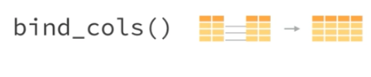
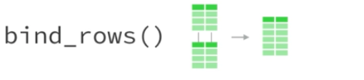
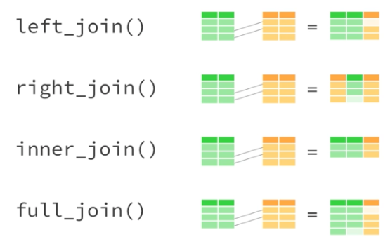

```{r setup, include=FALSE}

knitr::opts_chunk$set(echo = TRUE, fig.align = "center")
```
class:  center, middle

##Organização e realização:
```{r echo=FALSE, fig.align='center', out.width="15%"}
knitr::include_graphics("img/rladies.jpeg")
```
[R-Ladies São Paulo](https://www.meetup.com/R-Ladies-Sao-Paulo)

##Apoio:

```{r echo=FALSE, fig.align='center', out.width="50%"}
knitr::include_graphics("img/loggi.png")
```

[Loggi](https://www.loggi.com/)

---
class:  center, middle
# O que é o R-Ladies?

R-Ladies é uma organização mundial que promove a diversidade de gênero na comunidade da linguagem R.
R-Ladies São Paulo integra, orgulhosamente, a organização R-Ladies Global, em São Paulo.

# Como?

Através de meetups e mentorias em um ambiente seguro e amigável.

Nosso principal objetivo é promover a linguagem computacional estatística R compartilhando conhecimento, assim, quem tiver interesse na linguagem será bem-vinda, independente do nível de conhecimento. 


Fonte: [About us - R-Ladies](https://rladies.org/about-us/), [Meetup R-Ladies São Paulo](https://www.meetup.com/R-Ladies-Sao-Paulo/)

---
class:   center, middle
# Para quem?
Nosso principal público-alvo são as pessoas que se identificam com o gênero feminino, portanto, mulheres cis, mulheres trans, bem como pessoas não-binárias e queer.

# Missão

Como uma iniciativa de diversidade, a missão das R-Ladies é alcançar uma representação proporcional de pessoas de gêneros atualmente sub-representados na comunidade R, incentivando, inspirando e caacitando-as.


Fonte: [About us - R-Ladies](https://rladies.org/about-us/), [Meetup R-Ladies São Paulo](https://www.meetup.com/R-Ladies-Sao-Paulo/)

---
class:   center, middle
## Como o R-Ladies começou?
```{r echo=FALSE, fig.align='center', out.width="20%"}
knitr::include_graphics("img/gabriela.jpeg")
```
**[Gabriela de Queiroz](https://github.com/gdequeiroz)** fundou o R-Ladies no dia **1 de outubro de 2012**. Ela queria retribuir à comunidade depois de ir a vários encontros e aprender muito de graça. O primeiro encontro R-Ladies foi realizado em ** San Francisco, Califórnia (Estados Unidos) **. Nos anos seguintes, mais capítulos do R-Ladies começaram em todo o mundo.

Fonte: [About us - R-Ladies](https://rladies.org/about-us/history/)


---
class:center, middle

```{r echo=FALSE, out.width="100%"}
knitr::include_graphics("img/shiny2.png")
```


Fonte: [R-Ladies Shiny App](https://gqueiroz.shinyapps.io/rshinylady/)  (26/01/2019)
---
class:   center, middle
# Código de conduta


O R-Ladies dedica-se a proporcionar uma experiência livre de assédio para todos. Não toleramos nenhuma forma de assédio aos participantes.


[Código de conduta - R-Ladies](https://github.com/rladies/starter-kit/wiki/Code-of-Conduct#portuguese)


---
class:  center, middle
# Como saber mais?

[Meetup](https://www.meetup.com/pt-BR/R-Ladies-Sao-Paulo)

Twitter: [@RLadiesGlobal](https://twitter.com/rladiesglobal)

Website: [https://rladies.org/](https://rladies.org/)

R-Ladies LATAM Blog (Latin America) - Em breve!


[R-Ladies - How do get involved](https://rladies.org/about-us/help/)

---
class:   center, middle

# R-Ladies São Paulo


```{r echo=FALSE, fig.align='center', out.width="70%"}
knitr::include_graphics("img/1meetupsp.jpeg")
```
**Primero Meetup R-Ladies em São Paulo - Agosto/2018**


---
class:   middle
# Cronograma de hoje

## Manhã:
- Revisão - O que é o tidyverse e dplyr
- Introdução ao purrr
- Introdução ao ggplot2 

## Tarde:

- Introdução ao ggplot2 
- Introdução ao RMarkdown

---
class:   middle, center
# Tidyverse
---

# O Tidyverse

É uma coleção de pacotes R projetados para a ciência de dados. Todos os pacotes compartilham uma mesma filosofia de desenvolvimento, sintaxe e estruturas de dados.

```{r eval=FALSE, include=TRUE}
install.packages("tidyverse") #para instalar o tidyverse
library(tidyverse) #para utilizar o tidyverse
```

```{r echo=FALSE, fig.align='center', out.width="60%"}
knitr::include_graphics("img/Tidyverse_packages.png")
```

---
# Relembrando: Pipe (%>%)

**Atalho**: CTRL + SHIFT + M

---
# Relembrando: dplyr

A ideia do pacote **dplyr** é tornar a manipulação de dados explícita utilizando verbos que indicam a ação a ser realizada. 

O encadeamento dos verbos com o banco de dados é realizado com o operador **pipe**: **%>%**

O dplyr foi desenhado para trabalhar com o operator pipe **%>%** do pacote magritrr.
---

# dplyr - os 6 verbos  

- **filter**(): seleciona linhas

- **arrange**(): ordena de acordo com uma ou mais colunas 

- **select**(): seleciona colunas 

- **mutate**(): cria/modifica colunas 

- **summarise**(): sumariza/agrega colunas

- **group_by**(): agrupa colunas

---
- **Carregar o dataset**

Utilizaremos o dataset `diamonds`, que vem no pacote ggplot2. 
```{r message=FALSE, warning=FALSE}
library(tidyverse)
#install.packages("ggplot2")
library(ggplot2)
DT::datatable(head(diamonds), fillContainer = FALSE)
diamonds <- ggplot2::diamonds
```

---
# dplyr - os n verbos

- Manipulação de observações 

    - **filter()**, distinct(), sample_frac(), sample_frac(), slice()
    - **arrange()**,desc(), add_row()

  
- Manipulação de variáveis

    - **select()**
        - matches(), starts_with(), countains(), num_range(), everything()  
        
    - **mutate()**, mutate_at(), mutate_if(), transmute(), add_column(), rename()
        - sum(), mean(), sd(), quantile(), n(), n_distinct(), if_else(), recode()
    
- Funções de síntese

    - **summarise()**, summarise_all(), summarise_at(), summarise_if()
    - **group_by()**, ungroup(), group_by_all(), group_by_at(), group_by_if() 

---
# dplyr - combinando tabelas

```{r, collapse = T}
band_members

band_surnames <- tibble(surname = c("Jagger", "Lennon", "McCatney"))

bind_cols(band_members, band_surnames)

```

---
# dplyr - combinando tabelas

<br>

```{r echo=FALSE, fig.align='center', out.width="83%"}

```


<br>


```{r echo=FALSE, fig.align='center', out.width="77%"}

```

---
# dplyr - mesclando tabelas

<br> 

```{r echo=FALSE, fig.align='center', out.width="85%"}

```

---
# dplyr - mesclando tabelas


```{r, collapse = T}
band_members %>% glimpse()

band_instruments %>%  glimpse()

left_join(band_members, band_instruments, by = "name") %>% glimpse()

```


---
# dplyr - mesclando tabelas


```{r, collapse = T}
right_join(band_members, band_instruments, by = "name") %>% glimpse()

inner_join(band_members, band_instruments) %>% glimpse()

full_join(band_members, band_instruments, by = "name") %>% glimpse()

```


---
# dplyr - mesclando tabelas


```{r, collapse = T}
glimpse(band_members)

glimpse(band_instruments2)

left_join(band_members, band_instruments2, by=c("name"="artist")) %>% glimpse()

```

---
# dplyr - mesclando tabelas

```{r, collapse = T}
base_A <- tibble(chave_nome_igual = c(1:3,NA), chave_nome_diferente_A = c(1:3,NA) , 
            var_nome_igual = letters[1:4], var_nome_diferente_A = letters[1:4]) %>% 
  glimpse()
```

```{r, collapse = T}
base_B <- tibble(chave_nome_igual = c(2:4,NA), chave_nome_diferente_B = c(2:4,NA), 
            var_nome_igual = letters[5:8], var_nome_diferente_B = letters[5:8]) %>% 
  glimpse()

```

---
# dplyr - mesclando tabelas

```{r, collapse = T}
full_join(base_A, base_B, 
          by = c("chave_nome_igual" = "chave_nome_igual", 
                 "chave_nome_diferente_A" = "chave_nome_diferente_B"),
          suffix =c(".A",".B")) %>% 
  glimpse()


```


---
# purrr - programação funcional

> em construção

R tem o core de uma linguagem funcional, 
com uma natureza de soluções centrada em funções 


- faça para 1
- crie a receita
- faça para todos!


---
# purrr - map

> em construção

**map(.x,.f)** 

Para cada ** .x ** faça ** .f **, onde:
- .x: vetor, uma lista, colunas de um data frame
- .f: o céu é o limite :)


---
# purrr - map & variações

> em construção

O **map()** sempre retorna uma lista, outras possibilidades:

- **map_lgl()** - lógico
- **map_chr()** - caracter
- **map_int()** - inteiro
- **map_dbl()** - double
- **map_dfr()** - 
- **map_dfc()** - 


---
# O que é o grammar of graphics?
  
  - A ideia básica é que de forma independente podemos especificar  e combinar blocos de construção de um gráfico para criar praticamente qualquer tipo de exibição gráfica desejada.

- Os blocos de construção (ou camadas)  de um gráfico incluem:

  - data
  - aesthetic mapping
  - geometric object
  - statistical transformations
  - scales
  - coordinate system
  - position adjustments
  - faceting
  
---
** Exemplo passo a passo - geom_histogram() **

A função ggplot() recebe um data frame e cria o bloco base do gráfico. Se rodarmos somente ela, teremos um painel em branco:
```{r warning=FALSE}

DT::datatable(head(diamonds), fillContainer = FALSE)
diamonds <- ggplot2::diamonds
#ggplot(data = diamonds)
diamonds %>% ggplot() #usando o pipe
```
---
** Exemplo passo a passo - geom_histogram() **

Porém para construirmos o gráfico precisamos dizer como as observações serão mapeadas nos aspectos visuais do gráfico e quais formas geométricas serão utilizadas para isso. #reescrever esse trecho
```{r warning=FALSE}
diamonds %>% ggplot() +
  geom_histogram(mapping = aes(x = depth))

```


---
** Desafio 1 **
Plotar a distribuição de frequências da variável price
```{r warning=FALSE}
diamonds %>% ggplot() +
  geom_histogram(mapping = aes(x = price))

```

---
** Exemplo passo a passo 2: geom_bar **

Para variáveis categóricas, ou seja, aquelas que representam uma categoria como qualidade (bom, ruim), sexo(M, F) ou no nosso caso, a qualidade do corte da pedra, podemos usar um gráfico de barras
```{r warning=FALSE}
diamonds %>% ggplot() +
  geom_bar(aes(x=cut))
```
---
** Exemplo passo a passo 2: geom_bar **
```{r warning=FALSE}
diamonds %>% ggplot()+
  geom_bar(aes(x=cut, fill=color))
```

---
** Exemplo passo a passo 2: geom_bar **
```{r warning=FALSE}
diamonds %>% ggplot() + 
  geom_bar(aes(x=cut, fill=color)) + theme_bw()
```

---
** Exemplo passo a passo 2: geom_bar **
```{r warning=FALSE}
diamonds %>%  ggplot(aes(x=cut, fill=color)) +
  geom_bar() + theme_bw() +
  labs(title = "Título do gráfico", x = "Corte do diamante", 
    y = "Contagem", fill = "Cor") +  
  facet_wrap(~clarity)
```
---
class:  inverse, center, middle
# RMarkdown e relatórios dinâmicos
---
## Rmarkdown
* É um tipo de arquivo que suporta códigos em R, texto, markdown e outros formatos.

* Apresenta os seus códigos, o resultado, e também os seus comentários.

* Arquivos **.Rmd** são reprodutíveis.

* São interessantes para trabalhar em equipe, para comunicar seus resultados, e para desenvolver seus códigos em R.

* O markdown é uma linguagem de marcação simples. 

* [Rmarkdown Cheatsheet](http://www.rstudio.com/wp-content/uploads/2016/03/rmarkdown-cheatsheet-2.0.pdf)

- Pacote [Rmarkdown](https://rmarkdown.rstudio.com/) 
- Pacote [knitr](http://yihui.name/knitr/)
- [Rmarkdown Cheatsheet](http://www.rstudio.com/wp-content/uploads/2016/03/rmarkdown-cheatsheet-2.0.pdf)

---
## Rmarkdown
* Possibilita exportar diferentes tipos de arquivos.
```{r echo=FALSE, fig.align='center', out.width="50%"}
knitr::include_graphics("img/markdown.png")
```

---
class: middle
## Como criar um arquivo RMarkdown?

No RStudio, clique em File → New File → R Markdown 
```{r echo=FALSE, fig.align='center'}
knitr::include_graphics("img/1.PNG")
```
 
---
class: middle
## Como criar um arquivo RMarkdown?

```{r echo=FALSE, fig.align='center', out.width="90%"}
knitr::include_graphics("img/New_R_Markdown.png")
```

---
class:  middle

# yaml - metadados do documento:
- **y**et **a**nother **m**arkup **l**anguage 
- Controla muitas das configurações do documento.
- title: título
- subtitle: subtítulo
- author: autor
- date: data
- output: formato (Ex: html_document, pdf_document, etc). 
- Cuidado com a **identação**

Leia também: [Output Formats - R Markdown: The Definitive Guide](https://bookdown.org/yihui/rmarkdown/output-formats.html)


```{r eval=FALSE, include=TRUE}
---
title: "Initial R Markdown document"
author: "Karl Broman"
date: "April 23, 2015"
output: html_document
---

```
---
# Markdown
* O markdown é uma linguagem de marcação simples. 
* [Rmarkdown Cheatsheet](http://www.rstudio.com/wp-content/uploads/2016/03/rmarkdown-cheatsheet-2.0.pdf)
* Elaborada para ser fácil de ler, fácil de escrever.


**Negrito**: `**bold**` 

_Itálico_: `_italics_`

---
#Sintaxe Markdown
**Adicionar títulos**

`# Título 1`

`## Título 2`

`### Título 3` 

# Título 1
## Título 2
### Título 3

---
class: middle
# Fazendo uma lista
Você pode fazer uma lista escrevendo com hífens ou asteriscos, como a seguir:

`* negrito com asteriscos duplos`

`* itálico com underline`

`* fonte do tipo código com crase`

ou dessa forma:

`- negrito com asteriscos duplos`

`- itálico com underline`

`- fonte do tipo código com crase`

Cada um vai aparecer como:

- negrito com asteriscos duplos
- itálico com underline
- fonte do tipo código com crase

Referência: [SW Carpentry](https://swcarpentry.github.io/r-novice-gapminder/15-knitr-markdown/index.html)


---
class: middle
# Fazendo uma lista enumerada
Você pode fazer uma lista numerada usando somente números. Você pode usar o mesmo número quantas vezes quiser: 

`1. negrito com asteriscos duplos`

`1. itálico com underline`

`1. fonte do tipo código com crase`

Isso irá aparecer como:

1. negrito com asteriscos duplos
1. itálico com underline
1. fonte do tipo código com crase


Referência: [SW Carpentry](https://swcarpentry.github.io/r-novice-gapminder/15-knitr-markdown/index.html)


---
class: middle
# Compilando o RMarkdown

Você compila o documento de RMarkdown para uma página html ao clicar no botão "Knit HTML" in canto superior esquerdo. 


#Desafio
Crie um novo documento R Markdown. Delete todos os chuncks de código de R e escreva um pouco de Markdown (algumas seções, textos estilizados e lista com itens). 

Converta o documento em uma webpage.

Você pode usar o [Rmarkdown Cheatsheet](http://www.rstudio.com/wp-content/uploads/2016/03/rmarkdown-cheatsheet-2.0.pdf) para referência.

Referência: [SW Carpentry](https://swcarpentry.github.io/r-novice-gapminder/15-knitr-markdown/index.html)

---
class: middle
# Mais de Markdown

Você pode fazer um hiperlink dessa forma: `[**texto para mostrar**](http://the-web-page.com)`.

Você pode incluir arquivo de imagem dessa forma: ``

Você pode fazer sobescrito (e.g., F~2~) com `F~2` e superescrito (e.g., F^2^) com `F^2^`.

Se você sabe como escrever equações em LaTeX, ficará feliz em saber que pode usar $ $ e $$ $$ para inserir equações matemáticas, como e `$E = mc^2$`e

$$y = \mu + \sum_{i=1}^p \beta_i x_i + \epsilon$$

Referência: [SW Carpentry](https://swcarpentry.github.io/r-novice-gapminder/15-knitr-markdown/index.html)

---
class: middle
# Chuncks de Código R

Markdown é interessante e útil, mas seu real poder vem da combinação de Markdown com chuncks de códigos em R. 
Isso  é o Markdown. Quando processado, o código em R será executado; se ele produz figuras, as figuras serão inseridas ao final do documento.

```{r echo=FALSE, fig.align='center'}
knitr::include_graphics("img/chunk.png")
```


- É uma boa ideia dar a cada chunck um nome, pois ele podem ajudar a corrigir erros, e, se quaisquer gráficos são produzidos, os nomes dos arquivos serão baseados no nome do chunck de código que os produzirem.


Referência: [SW Carpentry](https://swcarpentry.github.io/r-novice-gapminder/15-knitr-markdown/index.html)
---
class: middle
# Como criar um chunck de código?

```{r echo=FALSE, fig.align='center'}
knitr::include_graphics("img/8.PNG")
```
 
Dica: Atalho do teclado para criar chunks:  `Ctrl + ALt + I`.


# Desafio
Adicione chunks de código para carregar o pacote dplyr

 
---
class: middle
# Como as coisas são compiladas?

- Quando você pressiona o botão “Knit HTML”, o documento R Markdown é processado pelo knitr e um documento Markdown é produzido (como, também, um potencial conjunto de arquivos de figuras): o código em R é executado e substituído pelo input e output; se figuras são produzidas, links para essas figuras serão incluídos.

- A seguir, os documentos Markdown e de figuras  são processados pela ferramenta pandoc, que converte o arquivo Markdown em um arquivo html, com as figuras anexadas.


```{r echo=FALSE, fig.align='center'}
knitr::include_graphics("img/rmd-15-rmd_to_html_fig-1.png")
```

Referência: [SW Carpentry](https://swcarpentry.github.io/r-novice-gapminder/15-knitr-markdown/index.html)


---
class: middle
#Opções de chunck

Há uma variedade de opções que podem afetar como os chuncks de código são tratados.

- Use `echo=FALSE` para evitar que o próprio código apareça.

- Use `results="hide"` para evitar que qualquer resultado seja impresso.

- Use `eval=FALSE` para mostrar o código, mas ele não é avaliado.

- Use `warning=FALSE` e `message=FALSE` para ocultar qualquer messagens de avisos produzidas.

- Use `out.width` para controlar o tamanho de figuras produzidas (Ex: `out.width = "100%"`).


Assim, você pode escrever:

```{r echo=FALSE, fig.align='center'}
knitr::include_graphics("img/chunk_load_libraries.png")
```
 
Referência: [SW Carpentry](https://swcarpentry.github.io/r-novice-gapminder/15-knitr-markdown/index.html)
 
---
class: middle
# Opções globais de chunck
Muitas vezes, haverá algumas opções que você irá querer repetir seu uso; para isso, você pode configurar as opções globais de chinck, como:  


```{r echo=FALSE, fig.align='center'}
knitr::include_graphics("img/chunk_global_options.png")
```

A opção `fig.path` define onde as figuras serão salvas. A `/` é importante, pois sem ela, as figuras seriam salvas no local padroã, mas só com nomes que começam com Figs. 


Referência: [SW Carpentry](https://swcarpentry.github.io/r-novice-gapminder/15-knitr-markdown/index.html)

---
class: middle
# Inline R code
Você pode fazer com que todo número em seu relatório seja reproduzível. 

```{r}
#Use `r e ` para um in-line code chunk . 
#O código será executado e
#substituído com o valor do resultado.

```


```{r eval=FALSE, include=TRUE}
`r code`

Ex:

`r round(3.14159265359, 2)`
```

`r round(3.14159265359, 2)`

Não deixe que esse chunck in-line seja separado através das linhas.

 

Referência: [SW Carpentry](https://swcarpentry.github.io/r-novice-gapminder/15-knitr-markdown/index.html)
---
class: middle
# Inline R code
Outro examplo:
```{r eval=FALSE, include=TRUE}
# O dataframe mtcars possui `r nrow(mtcars)` carros. 
```

Exemplo: O dataframe mtcars possui `r nrow(mtcars)` carros.
---
class: middle
# Desafio


- Tente um pouco de código R in-line.


Referência: [SW Carpentry](https://swcarpentry.github.io/r-novice-gapminder/15-knitr-markdown/index.html)


---
class: middle
# Exemplo: adicionando um gráfico
```{r}
attach(mtcars)
plot(wt, mpg, main="Exemplo de Gráfico de Dispersão",
xlab="Peso do Carro ", ylab="Milhas Por Galão ", pch=19)
```
---
class: middle
# Exemplo: adicionando uma tabela simples

```{r }
head(mtcars)
```
---
class: middle
# Exemplo: adicionando uma tabela
```{r}
DT::datatable(head(mtcars, 10),
  fillContainer = FALSE, options = list(pageLength = 5))
```
---
class: middle
# Adicionando imagens usando o Knitr

Função: `knitr::include_graphics()`

Exemplo:
```{r  out.width = "50%"}
knitr::include_graphics("https://www.r-project.org/Rlogo.png")
```
---
class: middle
# Adicionando imagens usando Knitr: opções de Chunk 

- `out.width = "50%"` - tamanho da imagem


```{r echo=FALSE, out.width = "50%"}
knitr::include_graphics("https://www.r-project.org/Rlogo.png")
```

[Opções do KnitR](https://yihui.name/knitr/options/#chunk-options)

---
class: middle
#Adicionando imagens usando Knitr: opções de Chunk 

- **Alinhamento da figura**
- `fig.align = 'center', 'default', **'left'**,'right'` 

```{r echo=FALSE,  out.width="20%", fig.align='left'} 
knitr::include_graphics("https://www.r-project.org/Rlogo.png")
```

- `fig.align = 'center', 'default', 'left', **'right' **`

```{r echo=FALSE,  out.width="20%", fig.align='right'}
knitr::include_graphics("https://www.r-project.org/Rlogo.png")
```
---
class: middle
#Adicionando imagens usando Knitr: opções de Chunk 

- Legenda de figura 

- `fig.cap="Logo R"`


```{r echo=FALSE,  out.width="50%", fig.cap="R Logo", fig.align='center'}
knitr::include_graphics("https://www.r-project.org/Rlogo.png")
```
---

class: middle
# Desafio
- Adicionar imagem 

- Usar opções de chunk para controlar o tamanho da figura e para esconder o código. 


Refêrencia: [SW Carpentry](https://swcarpentry.github.io/r-novice-gapminder/15-knitr-markdown/index.html)
---
class: middle
# Outras opções de saída
Você também pode converter o R Markdown para PDF ou um documento Word. Clique no pequeno triângulo próximo ao botão "Knit HTML" para aparecer um menu. Ou você pode colocar pdf_document ou word_document ino cabeçalho do arquivo.

```{r echo=FALSE, fig.align='center'}
knitr::include_graphics("img/knit.png")
```

Dica: Criando documentos em PDF
Criando documentos em .pdf pode requerer a instalação de TeX. Se pedido, isso é detalhado numa mensagem de erro..


Referência: [SW Carpentry](https://swcarpentry.github.io/r-novice-gapminder/15-knitr-markdown/index.html)

---
#Desafio
- Use o que aprendeu sobre RMarkdown e crie um pequeno relatório das atividades que fizemos hoje!

- O [Cheat Sheet do RMarkdown](http://www.rstudio.com/wp-content/uploads/2016/03/rmarkdown-cheatsheet-2.0.pdf) pode te ajudar!

---
class: middle
# Outras opções de saída

- Você pode fazer apresentações usando R, RMarkdown e KnitR - Use o pacote  [Xaringan](https://github.com/yihui/xaringan); (essa apresentação foi feita com Xaringan!)

- Rmd compila em um formato HTML. Entoã você pode criar páginas html usando essa ferramenta. O pacote **[prettydoc](https://cran.r-project.org/web/packages/prettydoc/vignettes/architect.html)** cpode ajudar com alguns temas se você não sabe prgramar em HTML e CSS.


- Veja a [galeria](https://rmarkdown.rstudio.com/gallery.html) for examples of what you can do with Rmarkdown.

- Veja mais: https://rmarkdown.rstudio.com/index.html

---
# DEU ERRO NO KNITR!

Calma! É bem comum dar erro ao compliar o arquivo pois **qualquer** código errado causa isso. Algumas coisas pra se observar:

- Yaml header - se algo estiver errado, vai dar erro ao compilar. Muito cuidado com a identação!

- Código nos chunks - teste o Run All Chunks e ver se dá erro em algum específico. Se descobrir, tente verificar o que há de errado no código (pode ser a falta de um parênteses, vírgula, entre outros).

```{r echo=FALSE, out.width="30%"}
knitr::include_graphics("https://media.giphy.com/media/j9GASQ5ocrIRicnmyq/giphy.gif")
```

---
# Referências


- https://r4ds.had.co.nz

- https://www.curso-r.com/material/

- https://www.tidyverse.org

- http://brunaw.com/slides/rladies-sp/13-08-2018/meetup.html#1

- https://github.com/MaryMS/2018-11-R-Course-FatecZS

- https://beatrizmilz.github.io/talk/oficina_intro_r_ufabc_2018/

- [SW Carpentry](https://swcarpentry.github.io/r-novice-gapminder/15-knitr-markdown/index.html)
... 


A apresentação foi feita em [xaringan](https://github.com/yihui/xaringan), um pacote do R! :)


---

class: middle, inverse

# Muito obrigada!

R-Ladies São Paulo