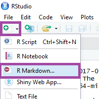
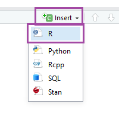
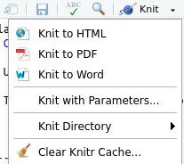

```{r setup, include=FALSE}

knitr::opts_chunk$set(echo = TRUE, fig.align = "center")
```
class:  center, middle

##Organização e realização:
```{r echo=FALSE, fig.align='center', out.width="15%"}
knitr::include_graphics("img/rladies.jpeg")
```
[R-Ladies S√£o Paulo](https://www.meetup.com/R-Ladies-Sao-Paulo)

##Apoio:

```{r echo=FALSE, fig.align='center', out.width="50%"}

```

[Loggi](https://www.loggi.com/)

---
class:  center, middle
# O que é o R-Ladies?

R-Ladies é uma organização mundial que promove a diversidade de gênero na comunidade da linguagem R.
R-Ladies São Paulo integra, orgulhosamente, a organização R-Ladies Global, em São Paulo.

# Como?

Através de meetups e mentorias em um ambiente seguro e amigável.

Nosso principal objetivo é promover a linguagem computacional estatística R compartilhando conhecimento, assim, quem tiver interesse na linguagem será bem-vinda, independente do nível de conhecimento. 


Fonte: [About us - R-Ladies](https://rladies.org/about-us/), [Meetup R-Ladies S√£o Paulo](https://www.meetup.com/R-Ladies-Sao-Paulo/)

---
class:   center, middle
# Para quem?
Nosso principal público-alvo são as pessoas que se identificam com o gênero feminino, portanto, mulheres cis, mulheres trans, bem como pessoas não-binárias e queer.

# Miss√£o

Como uma iniciativa de diversidade, a missão das R-Ladies é alcançar uma representação proporcional de pessoas de gêneros atualmente sub-representados na comunidade R, incentivando, inspirando e caacitando-as.


Fonte: [About us - R-Ladies](https://rladies.org/about-us/), [Meetup R-Ladies S√£o Paulo](https://www.meetup.com/R-Ladies-Sao-Paulo/)

---
class:   center, middle
## Como o R-Ladies começou?
```{r echo=FALSE, fig.align='center', out.width="20%"}
knitr::include_graphics("img/gabriela.jpeg")
```
**[Gabriela de Queiroz](https://github.com/gdequeiroz)** fundou o R-Ladies no dia **1 de outubro de 2012**. Ela queria retribuir à comunidade depois de ir a vários encontros e aprender muito de graça. O primeiro encontro R-Ladies foi realizado em ** San Francisco, Califórnia (Estados Unidos) **. Nos anos seguintes, mais capítulos do R-Ladies começaram em todo o mundo.

Fonte: [About us - R-Ladies](https://rladies.org/about-us/history/)


---
class:center, middle

```{r echo=FALSE, out.width="100%"}
knitr::include_graphics("img/shiny2.png")
```


Fonte: [R-Ladies Shiny App](https://gqueiroz.shinyapps.io/rshinylady/)  (26/01/2019)
---
class:   center, middle
# Código de conduta


O R-Ladies dedica-se a proporcionar uma experiência livre de assédio para todos. Não toleramos nenhuma forma de assédio aos participantes.


[Código de conduta - R-Ladies](https://github.com/rladies/starter-kit/wiki/Code-of-Conduct#portuguese)


---
class:  center, middle
# Como saber mais?

[Meetup](https://www.meetup.com/pt-BR/R-Ladies-Sao-Paulo)

Twitter: [@RLadiesGlobal](https://twitter.com/rladiesglobal)

Website: [https://rladies.org/](https://rladies.org/)

R-Ladies LATAM Blog (Latin America) - Em breve!


[R-Ladies - How do get involved](https://rladies.org/about-us/help/)

---
class:   center, middle

# R-Ladies S√£o Paulo


```{r echo=FALSE, fig.align='center', out.width="70%"}
knitr::include_graphics("img/1meetupsp.jpeg")
```
**Primero Meetup R-Ladies em S√£o Paulo - Agosto/2018**


---
class:   middle
# Cronograma de hoje

## Manh√£:
- Revisão - O que é o tidyverse e dplyr
- Introdução ao purrr
- Introdução ao ggplot2 

## Tarde:

- Introdução ao ggplot2 
- Introdução ao RMarkdown

---
class:   middle, center
# Tidyverse
---

# O Tidyverse

É uma coleção de pacotes R projetados para a ciência de dados. Todos os pacotes compartilham uma mesma filosofia de desenvolvimento, sintaxe e estruturas de dados.

```{r eval=FALSE, include=TRUE}
install.packages("tidyverse") #para instalar o tidyverse
library(tidyverse) #para utilizar o tidyverse
```

```{r echo=FALSE, fig.align='center', out.width="60%"}
knitr::include_graphics("img/Tidyverse_packages.png")
```

---
# Relembrando: Pipe (%>%)

**Atalho**: CTRL + SHIFT + M

---
# Relembrando: dplyr

A ideia do pacote **dplyr** é tornar a manipulação de dados explícita utilizando verbos que indicam a ação a ser realizada. 

O encadeamento dos verbos com o banco de dados é realizado com o operador **pipe**: **%>%**

O dplyr foi desenhado para trabalhar com o operator pipe **%>%** do pacote magritrr.
---

# Os 6 verbos do dplyr 

- **filter**(): seleciona linhas

- **arrange**(): ordena de acordo com uma ou mais colunas 

- **select**(): seleciona colunas 

- **mutate**(): cria/modifica colunas 

- **summarise**(): sumariza/agrega colunas

- **group_by**(): agrupa colunas

---
- **Carregar o dataset**

Utilizaremos o dataset `diamonds`, que vem no pacote ggplot2. 
```{r message=FALSE, warning=FALSE}
library(tidyverse)
#install.packages("ggplot2")
library(ggplot2)
DT::datatable(head(diamonds), fillContainer = FALSE)
diamonds <- ggplot2::diamonds
```

---
# Dplyr - Join


---
# Purrr


---
### O que È o ggplot2?

- … um pacote usado para visualizaÁ„o de dados.

- … uma implementaÁ„o do Grammar of Graphics de Leland Wilkinson -  um sistema coerente para descrever e construir gr·ficos. Ou seja, ele foi desenvolvido pautado em v·rios conceitos estatÌsticos importantes.

- [Cheatsheet em portuguÍs](https://www.rstudio.com/wp-content/uploads/2016/03/ggplot2-cheatsheet-portuguese.pdf)

- **Materiais interessantes:**

  *[Workshop Code Your Graph](https://alison.rbind.io/html/jamboree_heart_ggplot.html)

  *[R for Data Science - capÌtulos 3 e 28](https://r4ds.had.co.nz/data-visualisation.html)

```{r echo=FALSE}
knitr::include_graphics("img/ggplot2.png")
```
---

** Exemplos passo a passo: Exemplo 1 - geom_bar **
```{r warning=FALSE}
diamonds %>% ggplot()
```
---
** Exemplos passo a passo: Exemplo 1 - geom_bar **
```{r warning=FALSE}
diamonds %>%  ggplot(aes(x=cut))
```
---
** Exemplos passo a passo: Exemplo 1 - geom_bar **
```{r warning=FALSE}
diamonds %>% ggplot(aes(x=cut))+
geom_bar()
```
---
** Exemplo 1 - geom_bar **
```{r warning=FALSE}
diamonds %>% ggplot(aes(x=cut, fill=color))+
geom_bar()
```

---
** Exemplo 1 - geom_bar **
```{r warning=FALSE}
diamonds %>% ggplot(aes(x=cut, fill=color))+
geom_bar()+theme_bw()
```
---

```{r warning=FALSE}
diamonds %>%  ggplot(aes(x=cut, fill=color)) +
  geom_bar() + theme_bw() +
  labs(title = "Título do gráfico", x = "Corte do diamante", 
    y = "Contagem", fill = "Cor") 
```
---

```{r warning=FALSE}
diamonds %>%  ggplot(aes(x=cut, fill=color)) +
  geom_bar() + theme_bw() +
  labs(title = "Título do gráfico", x = "Corte do diamante", 
    y = "Contagem", fill = "Cor") +  
  facet_wrap(~clarity)
```
---
class:  inverse, center, middle
# RMarkdown e relatórios dinâmicos
---
## Rmarkdown
* É um tipo de arquivo que suporta códigos em R, texto, markdown e outros formatos.

* Apresenta os seus códigos, o resultado, e também os seus comentários.

* Arquivos **.Rmd** são reprodutíveis.

* São interessantes para trabalhar em equipe, para comunicar seus resultados, e para desenvolver seus códigos em R.

* O markdown é uma linguagem de marcação simples. 

* [Rmarkdown Cheatsheet](http://www.rstudio.com/wp-content/uploads/2016/03/rmarkdown-cheatsheet-2.0.pdf)

- Pacote [Rmarkdown](https://rmarkdown.rstudio.com/) 
- Pacote [knitr](http://yihui.name/knitr/)
- [Rmarkdown Cheatsheet](http://www.rstudio.com/wp-content/uploads/2016/03/rmarkdown-cheatsheet-2.0.pdf)

---
## Rmarkdown
* Possibilita exportar diferentes tipos de arquivos.
```{r echo=FALSE, fig.align='center', out.width="50%"}
knitr::include_graphics("img/markdown.png")
```

---
class: middle
## Como criar um arquivo RMarkdown?

No RStudio, clique em File ‚Üí New File ‚Üí R Markdown 
```{r echo=FALSE, fig.align='center'}

```
 
---
class: middle
## Como criar um arquivo RMarkdown?

```{r echo=FALSE, fig.align='center', out.width="90%"}
knitr::include_graphics("img/New_R_Markdown.png")
```

---
class:  middle

# yaml - metadados do documento:
- **y**et **a**nother **m**arkup **l**anguage 
- Controla muitas das configurações do documento.
- title: título
- subtitle: subtítulo
- author: autor
- date: data
- output: formato (Ex: html_document, pdf_document, etc). 
- Cuidado com a **identação**

Leia também: [Output Formats - R Markdown: The Definitive Guide](https://bookdown.org/yihui/rmarkdown/output-formats.html)


```{r eval=FALSE, include=TRUE}
---
title: "Initial R Markdown document"
author: "Karl Broman"
date: "April 23, 2015"
output: html_document
---

```
---
# Markdown
* O markdown é uma linguagem de marcação simples. 
* [Rmarkdown Cheatsheet](http://www.rstudio.com/wp-content/uploads/2016/03/rmarkdown-cheatsheet-2.0.pdf)
* Elaborada para ser f√°cil de ler, f√°cil de escrever.


**Negrito**: `**bold**` 

_It√°lico_: `_italics_`

---
#Sintaxe Markdown
**Adicionar títulos**

`# Título 1`

`## Título 2`

`### Título 3` 

# Título 1
## Título 2
### Título 3

---
class: middle
# Making a bullet list
You can make a bulleted list by writing a list with hyphens or asterisks, like this:

`* bold with double-asterisks`

`* italics with underscores`

`* code-type font with backticks`

or like this:

`- bold with double-asterisks`

`- italics with underscores`

`- code-type font with backticks`

Each will appear as:

- bold with double-asterisks
- italics with underscores
- code-type font with backticks


Reference: [SW Carpentry](https://swcarpentry.github.io/r-novice-gapminder/15-knitr-markdown/index.html)


---
class: middle
# Making a numbered list
You can make a numbered list by just using numbers. You can use the same number over and over if you want:

`1. bold with double-asterisks`

`1. italics with underscores`

`1. code-type font with backticks`

This will appear as:

1. bold with double-asterisks
1. italics with underscores
1. code-type font with backticks


Reference: [SW Carpentry](https://swcarpentry.github.io/r-novice-gapminder/15-knitr-markdown/index.html)


---
class: middle
# Compile the RMarkdown

You compile the R Markdown document to an html webpage by clicking the “Knit HTML” in the upper-left. 


#Challenge
Create a new R Markdown document. Delete all of the R code chunks and write a bit of Markdown (some sections, some italicized text, and an itemized list).

Convert the document to a webpage.

You can use the [Rmarkdown Cheatsheet](http://www.rstudio.com/wp-content/uploads/2016/03/rmarkdown-cheatsheet-2.0.pdf) for reference.

Reference: [SW Carpentry](https://swcarpentry.github.io/r-novice-gapminder/15-knitr-markdown/index.html)

---
class: middle
# More on Markdown

You can make a hyperlink like this: `[text to show](http://the-web-page.com)`.

You can include an image file like this: ``

You can do subscripts (e.g., F~2~) with `F~2` and superscripts (e.g., F^2^) with `F^2^`.

If you know how to write equations in LaTeX, you’ll be glad to know that you can use $ $ and $$ $$ to insert math equations, like `$E = mc^2$` and

$$y = \mu + \sum_{i=1}^p \beta_i x_i + \epsilon$$

Reference: [SW Carpentry](https://swcarpentry.github.io/r-novice-gapminder/15-knitr-markdown/index.html)

---
class: middle
# R Code Chunks

Markdown is interesting and useful, but the real power comes from mixing markdown with chunks of R code.
This is R Markdown. When processed, the R code will be executed; if they produce figures, the figures will be inserted in the final document.

```{r echo=FALSE, fig.align='center'}
knitr::include_graphics("img/chunk.png")
```


- It’s a good idea to give each chunk a name, as they will help you to fix errors and, if any graphs are produced, the file names are based on the name of the code chunk that produced them.


Reference: [SW Carpentry](https://swcarpentry.github.io/r-novice-gapminder/15-knitr-markdown/index.html)
---
class: middle
# How to create a code chunk?

```{r echo=FALSE, fig.align='center'}

```
 
Tip: Keyboard shortchut for creating a code chunk is:  `Ctrl + ALt + I`.


# Challenge
Add code chunks to load the dplyr package
 
 
---
class: middle
# How things get compiled? 

- When you press the “Knit HTML” button, the R Markdown document is processed by knitr and a plain Markdown document is produced (as well as, potentially, a set of figure files): the R code is executed and replaced by both the input and the output; if figures are produced, links to those figures are included.

- The Markdown and figure documents are then processed by the tool pandoc, which converts the Markdown file into an html file, with the figures embedded.


```{r echo=FALSE, fig.align='center'}
knitr::include_graphics("img/rmd-15-rmd_to_html_fig-1.png")
```

Reference: [SW Carpentry](https://swcarpentry.github.io/r-novice-gapminder/15-knitr-markdown/index.html)


---
class: middle
#Chunk options

There are a variety of options to affect how the code chunks are treated.

- Use `echo=FALSE` to avoid having the code itself shown.

- Use `results="hide"` to avoid having any results printed.

- Use `eval=FALSE` to have the code shown but not evaluated.

- Use `warning=FALSE` and `message=FALSE` to hide any warnings or messages produced.

- Use `out.width` to control the size of the figures produced (Ex: `out.width = "100%"`.


So you might write:

```{r echo=FALSE, fig.align='center'}
knitr::include_graphics("img/chunk_load_libraries.png")
```
 
Reference: [SW Carpentry](https://swcarpentry.github.io/r-novice-gapminder/15-knitr-markdown/index.html)
 
---
class: middle
# Chunk global options
Often there will be particular options that you’ll want to use repeatedly; for this, you can set global chunk options, like so:


```{r echo=FALSE, fig.align='center'}
knitr::include_graphics("img/chunk_global_options.png")
```

The `fig.path` option defines where the figures will be saved. The `/` here is really important; without it, the figures would be saved in the standard place but just with names that begin with Figs.


Reference: [SW Carpentry](https://swcarpentry.github.io/r-novice-gapminder/15-knitr-markdown/index.html)

---
class: middle
# Inline R code
You can make every number in your report reproducible.

```{r}
#Use `r and ` for an in-line code chunk . 
#The code will be executed and 
#replaced with the value of the result.

```


```{r eval=FALSE, include=TRUE}
`r code`

Ex:

`r round(3.14159265359, 2)`
```

`r round(3.14159265359, 2)`

Don’t let these in-line chunks get split across lines.

 

Reference: [SW Carpentry](https://swcarpentry.github.io/r-novice-gapminder/15-knitr-markdown/index.html)
---
class: middle
# Inline R code
Another example:
```{r eval=FALSE, include=TRUE}
# The dataframe mtcars has `r nrow(mtcars)` cars. 
```

Example: The dataframe mtcars has `r nrow(mtcars)` cars.
---
class: middle
# Challenge


- Try out a bit of in-line R code.


Reference: [SW Carpentry](https://swcarpentry.github.io/r-novice-gapminder/15-knitr-markdown/index.html)


---
class: middle
# Example: adding a graph
```{r}
attach(mtcars)
plot(wt, mpg, main="Scatterplot Example",
xlab="Car Weight ", ylab="Miles Per Gallon ", pch=19)
```
---
class: middle
# Example: adding a simple table

```{r }
head(mtcars)
```
---
class: middle
# Example: adding a table
```{r}
DT::datatable(head(mtcars, 10),
  fillContainer = FALSE, options = list(pageLength = 5))
```
---
class: middle
# Adding images using Knitr

Function: `knitr::include_graphics()`

Example:
```{r  out.width = "50%"}
knitr::include_graphics("https://www.r-project.org/Rlogo.png")
```
---
class: middle
# Adding images using Knitr: Chunk options

- `out.width = "50%"` - size of the image


```{r echo=FALSE, out.width = "50%"}
knitr::include_graphics("https://www.r-project.org/Rlogo.png")
```

[KnitR Options](https://yihui.name/knitr/options/#chunk-options)

---
class: middle
#Adding images using Knitr: Chunk options

- **Figure alignment**
- `fig.align = 'center', 'default', **'left'**,'right'` 

```{r echo=FALSE,  out.width="20%", fig.align='left'} 
knitr::include_graphics("https://www.r-project.org/Rlogo.png")
```

- `fig.align = 'center', 'default', 'left', **'right' **`

```{r echo=FALSE,  out.width="20%", fig.align='right'}
knitr::include_graphics("https://www.r-project.org/Rlogo.png")
```
---
class: middle
#Adding images using Knitr: Chunk options

- Figure caption

- `fig.cap="R Logo"`


```{r echo=FALSE,  out.width="50%", fig.cap="R Logo", fig.align='center'}
knitr::include_graphics("https://www.r-project.org/Rlogo.png")
```
---

class: middle
# Challenge
- Add a image 

- Use chunk options to control the size of a figure and to hide the code. 


Reference: [SW Carpentry](https://swcarpentry.github.io/r-novice-gapminder/15-knitr-markdown/index.html)
---
class: middle
# Other output options
You can also convert R Markdown to a PDF or a Word document. Click the little triangle next to the “Knit HTML” button to get a drop-down menu. Or you could put pdf_document or word_document in the header of the file.

```{r echo=FALSE, fig.align='center'}

```

Tip: Creating PDF documents
Creating .pdf documents may require installation of TeX. If required this is detailed in an error message.


Reference: [SW Carpentry](https://swcarpentry.github.io/r-novice-gapminder/15-knitr-markdown/index.html)


---
class: middle
# Other output options

- You can make presentations using R, RMarkdown and KnitR - Use the package  [Xaringan](https://github.com/yihui/xaringan); (this presentation was made with Xaringan!)

- Rmd compiles in a HTML format. So you can create html pages using this tool. Package **[prettydoc](https://cran.r-project.org/web/packages/prettydoc/vignettes/architect.html)** can help with some themes if  you don't know how to code in HTML and CSS.


- See the [gallery](https://rmarkdown.rstudio.com/gallery.html) for examples of what you can do with Rmarkdown.

- See more: https://rmarkdown.rstudio.com/index.html

---
# DEU ERRO NO KNITR!

Calma! É bem comum dar erro ao compliar o arquivo pois **qualquer** código errado causa isso. Algumas coisas pra se observar:

- Yaml header - se algo estiver errado, vai dar erro ao compilar. Muito cuidado com a identação!

- Código nos chunks - teste o Run All Chunks e ver se dá erro em algum específico. Se descobrir, tente verificar o que há de errado no código (pode ser a falta de um parênteses, vírgula, entre outros).

```{r echo=FALSE, out.width="30%"}
knitr::include_graphics("https://media.giphy.com/media/j9GASQ5ocrIRicnmyq/giphy.gif")
```

---
# Referências


- https://r4ds.had.co.nz

- https://www.curso-r.com/material/

- https://www.tidyverse.org

- http://brunaw.com/slides/rladies-sp/13-08-2018/meetup.html#1

- https://github.com/MaryMS/2018-11-R-Course-FatecZS

- https://beatrizmilz.github.io/talk/oficina_intro_r_ufabc_2018/

- [SW Carpentry](https://swcarpentry.github.io/r-novice-gapminder/15-knitr-markdown/index.html)
... 


A apresentação foi feita em [xaringan](https://github.com/yihui/xaringan), um pacote do R! :)


---

class: middle, inverse

# Muito obrigada!

R-Ladies S√£o Paulo